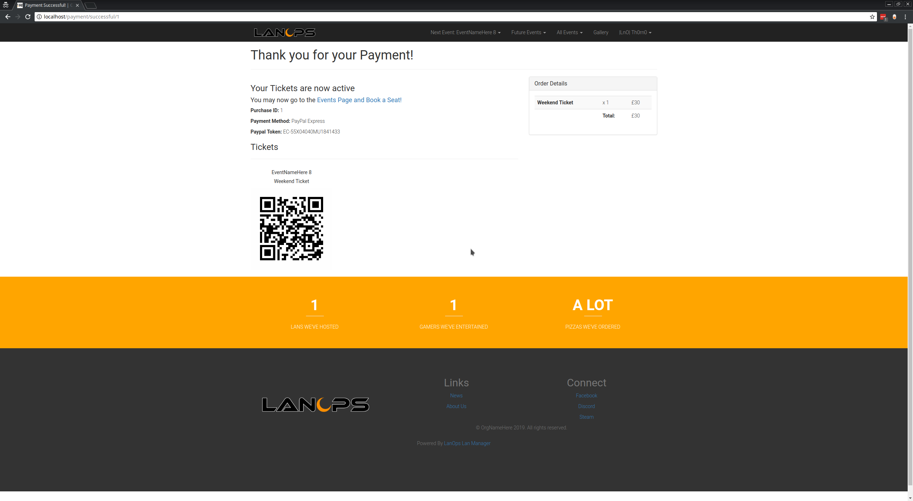
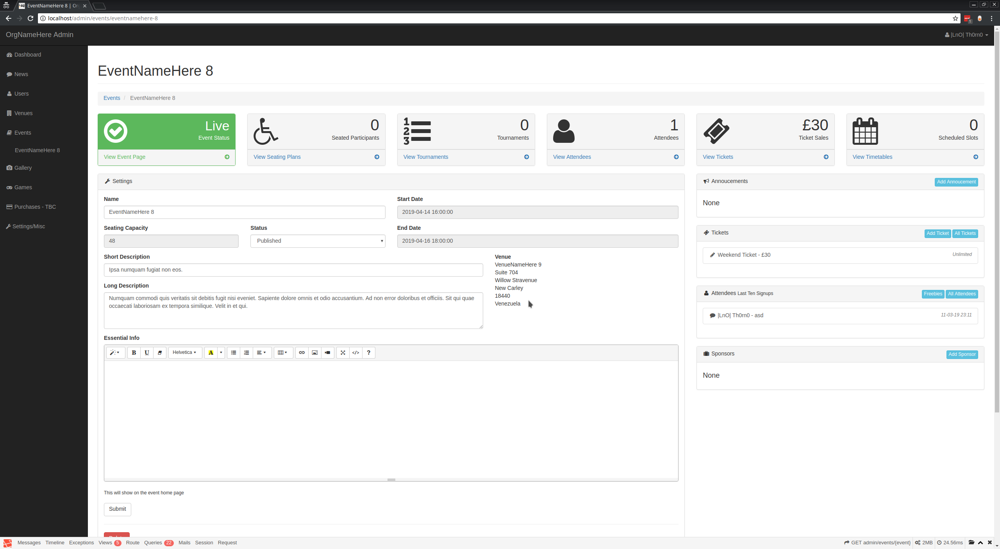
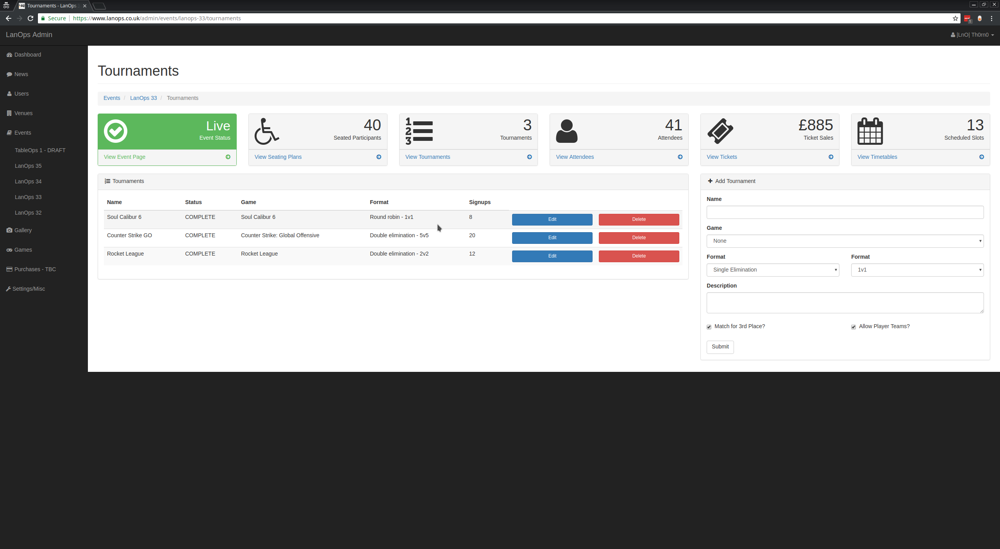
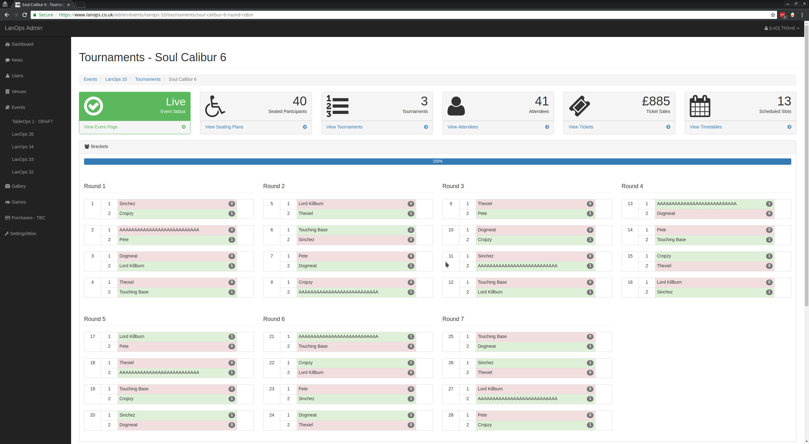

# LanOps Lan Manager

Master: [](http://drone.th0rn0.co.uk/LanOps/Manager)

The Lan Manager is a fully featured White labeled Event Management system. The only prerequisite is `docker and/or docker-compose`. Everything is self contained. The purpose of this application was to remove the need for websites like WIX, SquareSpace, EventBrite or bloated Wordpress plugins that charge a small fortune for use of their code base and/or services all the while keeping all of the IPs and rights to your event hosting and ticket sales. Coupled with this there was no decent fully fledged alternative to the likes of ALP (2004 baby!) that did everything we (LanOps) needed. There was a lot of software out there but there wasn't one unified application that tied all these services such as tournaments, ticket management & sales, event signup, server management all in a easily extendable OPEN SOURCE package.

Thus the LanOps Lan Manager was born!

https://lanops.co.uk

##### Home Page:


##### Event Page:

##### Successful Payment Page

##### Event Management

##### Ticket Management

##### Tournament Management

##### Tournament Brakcets


##### Features

- White Label
- Event Management
  - Signup/Info Pages
  - Tickets
  - Signups/Gifts/Staff/Refunds
  - Timetables
  - Tournaments
  - Seating
- Steam Integration
  - All Logins are done via Steam - NO MORE PASSWORDS!
- Ticket Management
  - Sale Periods
  - Limited Quantity
  - Weekend, Day, Spectator Ticket Types
  - Eligible/Non Eligible for seats Ticket Type supported!
  - QR Codes supported!
- Seating Plans
  - Multiple Plans per Event supported!
  - Manual seating of participants
- Venue Management
- User Management
- Timetable Management
  - Multiple timetables per event supported!
- Tournament Management
  - Supported via Challonge API
  - 1v1, Teams and PUGs supported!
  - Single/Double Elimination and Round Robin supported!
- Event Sign in
  - Sign in via QR Code
- Event specific page for when at the event
  - Shows Timetables, Attendees, Tournaments, Announcements and Seating
- Gallery
- Admin Interface
- API Endpoints
  - Events
  - Participants
  - Seating
  - Timetables
- Payments
  - Terms & Conditions
  - Paypal Express
  - Breakdowns in Admin
- Voting and Poll Management
- News Management
- Comment Management
- Account Management
- Fully Encapsulated in Docker Containers
- Built on Laravel
- Easily Expandable
- NGINX, MYSQL & PHP Docker stack

## Installation Prerequisites

### Prerequisites

- Docker v17
- Docker-compose v1.18
- Paypal Account for payments
- Challonge API key
  - A verified challonge account is required - https://challonge.com/settings/developer
- Steam Developers API Key
  - Any Steam API key will do. It's best to create a new account though - https://steamcommunity.com/dev/apikey
- Google Analytics Tracking ID
  - Optional but highly recommended

## Usage

There are 3 ways to run the Lan Manager

### Docker

This method is intended to be run as just a image with your own database. Persistant storage is required for the storage/ directory.

```
docker run -it -d \
  -e APP_DEBUG=true \
  -e APP_ENV=local \
  -e APP_URL=localhost \
  -e DB_HOST=database \
  -e DB_DATABASE=lan_manager \
  -e DB_PORT=3306 \
  -e DB_USERNAME=lan_manager \
  -e DB_PASSWORD=password \
  -e ANALYTICS_TRACKING_ID= \
  -e PAYPAL_USERNAME= \
  -e PAYPAL_PASSWORD= \
  -e PAYPAL_SIGNATURE= \
  -e STEAM_API_KEY= \
  -e CHALLONGE_API_KEY= \
  -e FACEBOOK_APP_ID= \
  -e FACEBOOK_APP_SECRET= \
  -e LOG_FILES=false \
  -e ENABLE_HTTPS=false \
  -e DB_CONNECTION=mysql \
  -e DB_MIGRATE=true \
  -p 80:80 \
  -p 443:443 \
  -v lan_manager_storage:/web/html/storage/ \
  --name lan_manager_app \
  lanopsdev/manager:latest
```

Follow Post-Docker Below

### Docker-compose

This method is intended to be run with docker-compose. It will create a full stack including database.

```
version: "3.4"
services:
  app:
    image: lanopsdev/manager:latest
    volumes:
      - lan_manager_certs:/etc/nginx/certs
      - lan_manager_storage:/web/html/storage/
    environment:
      # App Config
      - APP_DEBUG=true
      - APP_ENV=local
      - APP_URL=localhost
      # Database Settings
      - DB_DATABASE=lan_manager
      - DB_USERNAME=lan_manager
      - DB_PASSWORD=password
      # Google Analytics
      - ANALYTICS_TRACKING_ID=
      # Paypal
      - PAYPAL_USERNAME=
      - PAYPAL_PASSWORD=
      - PAYPAL_SIGNATURE=
      # Steam
      - STEAM_API_KEY=
      # Challonge
      - CHALLONGE_API_KEY=
      # Facebook
      - FACEBOOK_APP_ID=
      - FACEBOOK_APP_SECRET=
      # File Logger
      - LOG_FILES=false
      # HTTPS
      - ENABLE_HTTPS=true
      # Migrate Database on Boot
      - DB_MIGRATE=true
      # DO NOT CHANGE BELOW
      - DB_CONNECTION=mysql
      - DB_PORT=3306
      - DB_HOST=database
    container_name: lan_manager_app
    ports:
      - 80:80
      - 443:443
  database:
    image: mysql:5.6
    volumes:
      - lan_manager_database:/var/lib/mysql
    environment:
      # Change The password as according
      - MYSQL_PASSWORD=password
      # DO NOT CHANGE BELOW
      - MYSQL_DATABASE=lan_manager
      - MYSQL_USER=lan_manager
      - MYSQL_RANDOM_ROOT_PASSWORD=true
    ports:
      - 3306:3306
    container_name: lan_manager_database
volumes:
  lan_manager_database
    name:
      lan_manager_database
  lan_manager_certs
    name:
      lan_manager_certs
  lan_manager_storage
    name:
      lan_manager_storage
```

Follow Post-Docker Below

### Post-Docker

When running for the first time you'll be a new APP_KEY will be generated. Keep this safe!. You'll need to add it to the env variables (EG ```-e APP_KEY=someRandomKey```) otherwise it will regenerate the APP_KEY on each reboot.

Once running and the database has migrated you will need to exec into the container and do the following;

Seed the Database with initial data
```
php artisan db:seed
```

### Makefile

This method is intended for development but can be used in production. It uses docker-compose to build the image and database from the source code instead of pulling them from docker hub.

#### 1. Setup & Configuration

Run ```make env-file``` to create a ```.env``` file in the ```src```  directory. Then modify it as according to your preferences. KEEP THIS SAFE & SECURE! This file holds the credentials used within the app. If any would be hacker was to get hold of this file they have access to everything! 

#### 2. Installation

##### First Time Build

To run a clean build run the command below. This will also generate self signed Certificates in the ```resources/certs``` directory.
```
make app-build-clean
```

##### Build Dependencies (Optional)

Install dependencies. This is run when ```app-build-clean``` is run.

```
make app-build-dep
```

##### Build Development App & Dependencies (Optional)

Install dependencies for Development

```
make app-build-dep-dev
```

#### 3. Run

Run the stack detached. This is re attachable. 

```
make
```

##### Interactive

Run the stack in the foreground. Once exited the stack will stop.

```
make interactive
```

##### Migrate & Seed Database

Run Database migrations and populate.

```
make database-migrate
make database-seed
```

#### Stop

Stop the stack.

```
make stop
```

## HTTPS

To enable HTTPS set ```ENABLE_HTTPS=true```. If you wish to use your own certs, copy them to ```resources/certs``` or mount in the certs to the ```/etc/nginx/certs``` directory on the container. 

### Caveats
- You must rename the certs to ```lan_manager.crt``` and ```lan_manager.key```.

## Secret Managers

The Lan Manager ships with a file reader for Env variables such as Passwords as API Keys for Secrets Managers such as Ranchers Secret Manager, EnvKey and Summon. To use it append ```_FILE``` to the Env variable and change the value to be the location of the secret file located on the container! It is recommended you mount a secrets directory into the container for example:

If we add the volume; ```resources/secrets/:/run/secrets``` and store our ```DB_PASSWORD``` in a file called ```DB_PASSWORD``` in ```resources/secrets/``` directory, we can set ```DB_PASSWORD_FILE=/run/secrets/DB_PASSWORD``` and the app will read the file and inject the password into the Environment Variable ```DB_PASSWORD```.

### Caveats

- Only one entry per file
- File must only container value
- The file can be named anything, but it must be reflected in the ```_FILE``` env variable
- It will only work on the following Env Variables;
  - FACEBOOK_APP_ID
  - FACEBOOK_APP_SECRET
  - DB_DATABASE
  - DB_USERNAME
  - DB_PASSWORD
  - MYSQL_DATABASE
  - MYSQL_USER
  - MYSQL_PASSWORD
  - ANALYTICS_TRACKING_ID
  - PAYPAL_USERNAME
  - PAYPAL_PASSWORD
  - PAYPAL_SIGNATURE
  - STEAM_API_KEY
  - CHALLONGE_API_KEY

## Contributors

- Th0rn0 - https://github.com/th0rn0
- 1nvert - https://github.com/richardmountain

##### To Do

- Refunds
- Twitch Integration
- Add more payment Gateways
- Unit Tests

## Sites that use the Lan Manager

- LanOps - https://lanops.co.uk
- EngLan - https://englan.co.uk
