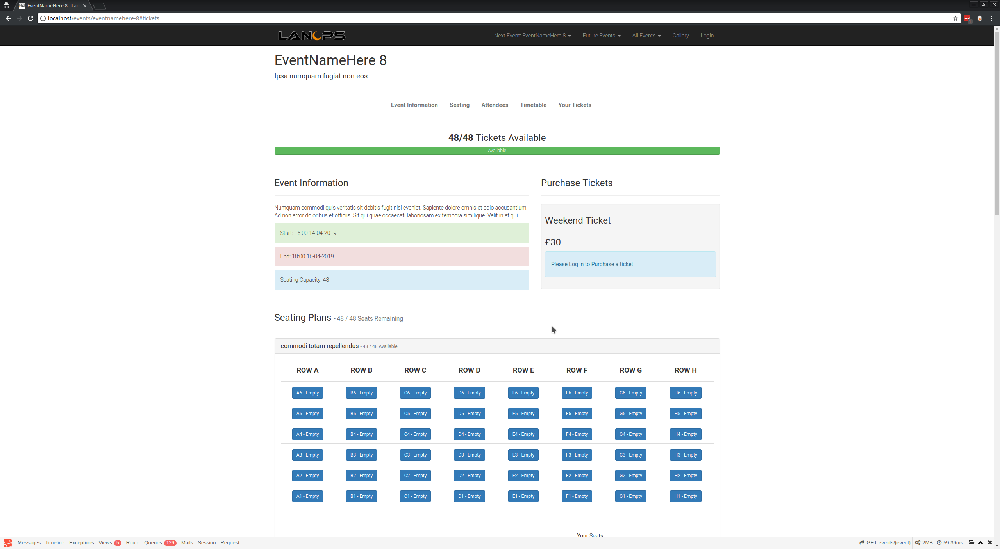
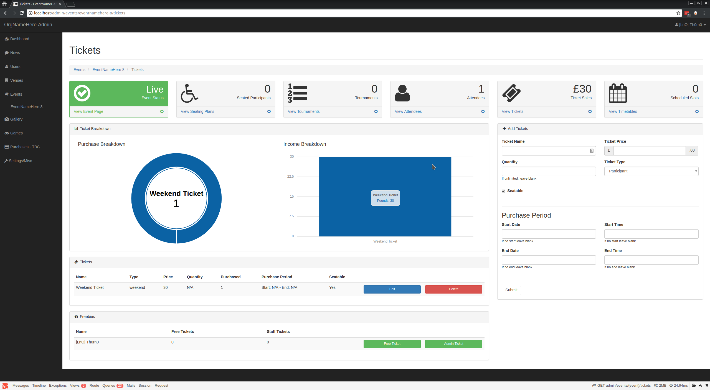

# LanOps Lan Manager

The Lan Manager is a fully featured White labeled Event Management system. The only prerequisite is `docker and/or docker-compose`. Everything is self contained. The purpose of this application is to unify Event Management (Venue, attendees, seating), Ticket Sales, Tournament Management, Shop Management and Credit Management. 

https://lanops.co.uk

##### Home Page:


##### Event Page:

##### Successful Payment Page

##### Event Management

##### Ticket Management

##### Tournament Management

##### Tournament Brakcets


##### Features

- White Label
- Event Management
  - Signup/Info Pages
  - Tickets
  - Signups/Gifts/Staff/Refunds
  - Timetables
  - Tournaments
  - Seating
- Steam Integration
  - All Logins are done via Steam - NO MORE PASSWORDS!
- Ticket Management
  - Sale Periods
  - Limited Quantity
  - Weekend, Day, Spectator Ticket Types
  - Eligible/Non Eligible for seats Ticket Type supported!
  - QR Codes supported!
- Seating Plans
  - Multiple Plans per Event supported!
  - Manual seating of participants
- Shop (beta)
- Credit System (beta)
- Venue Management
- User Management
- Timetable Management
  - Multiple timetables per event supported!
- Tournament Management
  - Supported via Challonge API
  - 1v1, Teams and PUGs supported!
  - Single/Double Elimination and Round Robin supported!
- Event Sign in
  - Sign in via QR Code
- Event specific page for when at the event
  - Shows Timetables, Attendees, Tournaments, Announcements and Seating
- Gallery
- Admin Interface
- Web based CSS Editor
- Expandable templating and CSS System
- API Endpoints
  - Events
  - Participants
  - Seating
  - Timetables
- Payments
  - Terms & Conditions
  - Paypal Express
  - Stripe Card payments (beta)
  - Breakdowns in Admin
- Voting and Poll Management
- News Management
- Comment Management
- Account Management
- Fully Encapsulated in Docker Containers
- Built on Laravel
- Easily Expandable
- NGINX, MYSQL & PHP Docker stack

## Installation Prerequisites

### Prerequisites

- Docker v17
- Docker-compose v1.18
- Paypal Account for payments
- Challonge API key
  - A verified challonge account is required - https://challonge.com/settings/developer
- Steam Developers API Key
  - Any Steam API key will do. It's best to create a new account though - https://steamcommunity.com/dev/apikey
- Google Analytics Tracking ID
  - Optional but highly recommended

## Usage

There are 3 ways to run the Lan Manager. Remember to check the logs when running for the first time!

### Docker

This method is intended to be run as just a image with your own database. Persistant storage is required for the storage/ directory.

```
docker run -it \
  -e APP_DEBUG=true \
  -e APP_ENV=local \
  -e APP_URL=localhost \
  -e DB_HOST=database \
  -e DB_DATABASE=lan_manager \
  -e DB_PORT=3306 \
  -e DB_USERNAME=lan_manager \
  -e DB_PASSWORD=password \
  -e ANALYTICS_TRACKING_ID= \
  -e PAYPAL_USERNAME= \
  -e PAYPAL_PASSWORD= \
  -e PAYPAL_SIGNATURE= \
  -e STEAM_API_KEY= \
  -e CHALLONGE_API_KEY= \
  -e FACEBOOK_APP_ID= \
  -e FACEBOOK_APP_SECRET= \
  -e LOG_FILES=false \
  -e ENABLE_HTTPS=false \
  -e DB_CONNECTION=mysql \
  -e DB_MIGRATE=true \
  -p 80:80 \
  -p 443:443 \
  -v lan_manager_storage:/web/html/storage/ \
  --name lan_manager_app \
  lanopsdev/manager:latest
```

Follow Post-Docker Below

### Docker-compose

This method is intended to be run with docker-compose. It will create a full stack including database, load balancer & SSL Encryption.

```
version: "3.4"
services:
  app:
    image: lanopsdev/manager:latest
    volumes:
      - lan_manager_certs:/etc/nginx/certs
      - lan_manager_storage:/web/html/storage/
    environment:
      # App Config
      - APP_DEBUG=true
      - APP_ENV=local
      - APP_URL=localhost
      # Database Settings
      - DB_DATABASE=lan_manager
      - DB_USERNAME=lan_manager
      - DB_PASSWORD=password
      # Google Analytics
      - ANALYTICS_TRACKING_ID=
      # Paypal
      - PAYPAL_USERNAME=
      - PAYPAL_PASSWORD=
      - PAYPAL_SIGNATURE=
      # Steam
      - STEAM_API_KEY=
      # Challonge
      - CHALLONGE_API_KEY=
      # Facebook
      - FACEBOOK_APP_ID=
      - FACEBOOK_APP_SECRET=
      # File Logger
      - LOG_FILES=false
      # HTTPS
      - ENABLE_HTTPS=false
      # Migrate Database on Boot
      - DB_MIGRATE=true
      # DO NOT CHANGE BELOW
      - DB_CONNECTION=mysql
      - DB_PORT=3306
      - DB_HOST=database
    container_name: lan_manager_app
    ports:
      - 80:80
      - 443:443
  database:
    image: mysql:5.6
    volumes:
      - lan_manager_database:/var/lib/mysql
    environment:
      # Change The password as according
      - MYSQL_PASSWORD=password
      # DO NOT CHANGE BELOW
      - MYSQL_DATABASE=lan_manager
      - MYSQL_USER=lan_manager
      - MYSQL_RANDOM_ROOT_PASSWORD=true
    ports:
      - 3306:3306
    container_name: lan_manager_database
  loadbalancer:
    image: traefik:v2.0
    volumes:
    - /var/run/docker.sock:/var/run/docker.sock:ro
    - lan_manager_certs:/certs:z
    - lan_manager_acme:/acme:z
    ports:
    - 80:80/tcp
    - 443:443/tcp
    # Debug Only
    # - 8080:8080/tcp
    command:
    # Debug Only
    # - --api.insecure=true
    - --providers.docker=true
    - --entryPoints.web.address=:80
    - --entryPoints.websecure.address=:443
    - --providers.docker.exposedByDefault=false
    - --certificatesresolvers.le.acme.email=me@mydomain.com
    - --certificatesresolvers.le.acme.storage=/acme/acme.json
    - --certificatesresolvers.le.acme.tlschallenge=true
    container_name: lan_manager_loadbalancer
volumes:
  lan_manager_database:
    name:
      lan_manager_database
  lan_manager_certs:
    name:
      lan_manager_certs
  lan_manager_storage:
    name:
      lan_manager_storage
  lan_manager_acme:
    name:
      lan_manager_acme
```

Follow Post-Docker Below

#### Post-Docker

When running for the first time you'll be a new APP_KEY will be generated. Keep this safe!. You'll need to add it to the env variables (EG ```-e APP_KEY=someRandomKey```) otherwise it will regenerate the APP_KEY on each reboot.

Once running and the database has migrated you will need to exec into the container and do the following;

Seed the Database with initial data
```
php artisan db:seed
```

### Makefile

This method is intended for development but can be used in production. It uses docker-compose to build the image and database from the source code instead of pulling them from docker hub.

#### 1. Setup & Configuration

Run ```make env-file``` to create a ```.env``` file in the ```src```  directory. Then modify it as according to your preferences. KEEP THIS SAFE & SECURE! This file holds the credentials used within the app. If any would be hacker was to get hold of this file they have access to everything! 

#### 2. Installation

##### First Time Build

To run a clean build run the command below. This will also generate self signed Certificates in the ```resources/certs``` directory.
```
make app-build-clean
```

##### Build Dependencies (Optional)

Install dependencies. This is run when ```app-build-clean``` is run.

```
make app-build-dep
```

##### Build Development App & Dependencies (Optional)

Install dependencies for Development

```
make app-build-dep-dev
```

#### 3. Run

Run the stack detached. This is re attachable. 

```
make
```

##### Interactive

Run the stack in the foreground. Once exited the stack will stop.

```
make interactive
```

##### Migrate & Seed Database

Run Database migrations and populate.

```
make database-migrate
make database-seed
```

#### Stop

Stop the stack.

```
make stop
```

## HTTPS

To enable HTTPS set ```ENABLE_HTTPS=true```. If you wish to use your own certs, copy them to ```resources/certs``` or mount in the certs to the ```/etc/nginx/certs``` directory on the container. 

### Caveats
- You must rename the certs to ```lan_manager.crt``` and ```lan_manager.key```.

## Secret Managers

The Lan Manager ships with a file reader for Env variables such as Passwords as API Keys for Secrets Managers such as Ranchers Secret Manager, EnvKey and Summon. To use it append ```_FILE``` to the Env variable and change the value to be the location of the secret file located on the container! It is recommended you mount a secrets directory into the container for example:

If we add the volume; ```resources/secrets/:/run/secrets``` and store our ```DB_PASSWORD``` in a file called ```DB_PASSWORD``` in ```resources/secrets/``` directory, we can set ```DB_PASSWORD_FILE=/run/secrets/DB_PASSWORD``` and the app will read the file and inject the password into the Environment Variable ```DB_PASSWORD```.

### Caveats

- Only one entry per file
- File must only container value
- The file can be named anything, but it must be reflected in the ```_FILE``` env variable
- It will only work on the following Env Variables;
  - FACEBOOK_APP_ID
  - FACEBOOK_APP_SECRET
  - DB_DATABASE
  - DB_USERNAME
  - DB_PASSWORD
  - MYSQL_DATABASE
  - MYSQL_USER
  - MYSQL_PASSWORD
  - ANALYTICS_TRACKING_ID
  - PAYPAL_USERNAME
  - PAYPAL_PASSWORD
  - PAYPAL_SIGNATURE
  - STEAM_API_KEY
  - CHALLONGE_API_KEY
  - APP_KEY
  
## Custom SCSS & Views

To load in custom SCSS (Sassy CSS) & Views (Blade) mount the following directories;

- ```path_to_scss:/web/html/resources/assets/sass```
- ```path_to_views:/web/html/resources/assets/views```

CSS must be in SCSS format.

To recompile CSS use the 'Recompile CSS' link located at http://localhost/admin/appearance

You can also change base variables and ad your own in the appearance page.

## Contributors

- Th0rn0 - https://github.com/th0rn0
- 1nvert - https://github.com/richardmountain

##### To Do

- Refunds
- Twitch Integration
- Add more payment Gateways
- Unit Tests

## Sites that use the Lan Manager

- LanOps - https://lanops.co.uk
- EngLan - https://englan.co.uk
